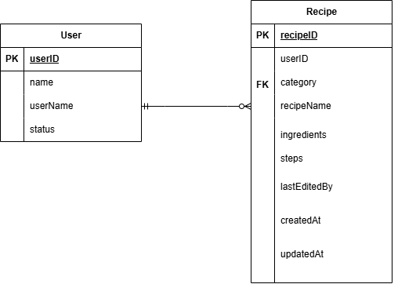
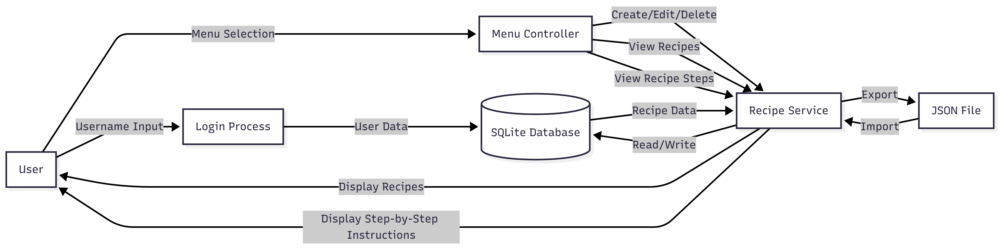

# File: SYSTEM_DESIGN.md

# System Design – Recipe Manager

## 1. Application Architecture

### High-Level Overview
Recipe Manager is a console-based TypeScript application that follows a **layered architecture** to separate concerns and improve maintainability.

The system consists of:
- Console User Interface (UI)
- Service Layer (Business Logic)
- Data Access Layer (SQLite)
- External File Handling (Import / Export)

---

## 2. Architecture Components

### Console UI
- Handles user login and menu navigation
- Collects user input
- Displays formatted output and messages

### Recipe Service
- Implements business logic
- Validates user input
- Coordinates database and file operations
- Handles import/export logic

### Data Access Layer
- Uses SQLite as the primary data store
- Executes SQL queries (CRUD)
- Ensures data persistence and integrity

### External JSON Files
- Used for recipe import and export
- Not part of the main database
- Validated before import

---

## 3. Component Interaction Flow

1. User enters username and menu selection
2. Console UI forwards request to Recipe Service
3. Recipe Service validates input
4. SQL queries are executed on the SQLite database
5. Results are returned to the service
6. Console UI displays output to the user
7. Import/export operations interact with external JSON files

---

## 4. Database Design (SQLite)

### Entity-Relationship Overview


The system currently uses two logical entities:
- **User**
- **Recipe**

---

### Table: `users`

| Column      | Type    | Constraints                     |
|------------|---------|----------------------------------|
| id         | INTEGER | Primary Key, Auto Increment      |
| username   | TEXT    | Unique, Not Null                 |
| created_at | TEXT    | Not Null                         |

---

### Table: `recipes`

| Column        | Type    | Constraints                              |
|--------------|---------|------------------------------------------|
| id           | INTEGER | Primary Key, Auto Increment              |
| user_id      | INTEGER | Foreign Key → users(id)                  |
| category     | TEXT    | Not Null                                 |
| name         | TEXT    | Not Null                                 |
| ingredients  | TEXT    | Not Null (JSON string)                   |
| steps        | TEXT    | Not Null (JSON string)                   |
| lastEditedBy | TEXT    | Not Null                                 |
| created_at   | TEXT    | Not Null                                 |
| updated_at   | TEXT    | Not Null                                 |

---

### Relationships
- One **User** can have many **Recipes**
- Each **Recipe** belongs to exactly one **User**

---

## 5. Data Flow

### Data Flow Diagram


### Data Flow Description

User Input → Console UI → Recipe Service → SQLite Database  
SQLite Results → Recipe Service → Console UI → User Output  

**Import / Export Flow:**  
Recipe Service ↔ External JSON Files

---

## 6. Import / Export Design

### Export
- Selected recipe is retrieved from SQLite
- Converted to JSON format
- Saved as an external file

### Import
- JSON file is read and validated
- Recipe data is inserted into SQLite
- Recipe ownership is assigned to the logged-in user

---

### JSON File Structure

**File Used:**
- `recipes.json`

**Sample JSON (Single Example):**
```json
{
  "recipes": [
    {
      "id": "1",
      "user": "angelo",
      "category": "Pastry",
      "name": "Pancakes",
      "ingredients": ["Flour", "Milk", "Eggs"],
      "steps": [
        "Mix dry ingredients",
        "Add milk and eggs",
        "Whisk until smooth",
        "Cook on pan until golden"
      ],
      "createdAt": "2026-01-08T08:30:00Z",
      "updatedAt": "2026-01-08T08:30:00Z"
    }
  ]
}
